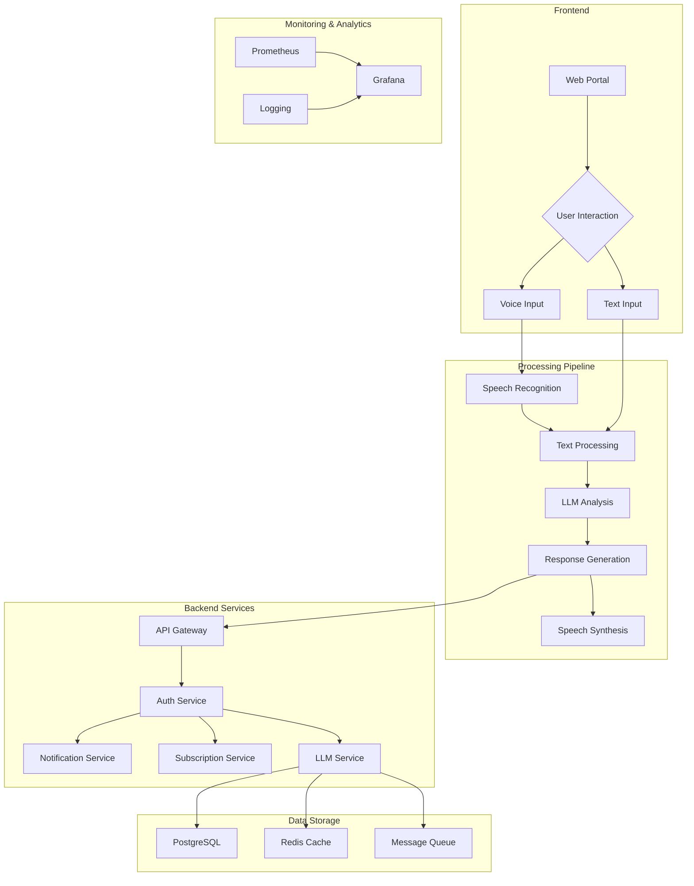

# Chatbot Infrastructure Architecture

## Author
Aldo Grandoni

## Overview
This directory contains the complete infrastructure and deployment architecture for the Chatbot platform, including both web and backend components.

## System Architecture



## Directory Structure

```
architecture/
├── deployment/
│   ├── k3s/
│   │   ├── charts/
│   │   │   ├── k3s-cluster/
│   │   │   ├── monitoring/
│   │   │   ├── storage/
│   │   │   ├── networking/
│   │   │   └── security/
│   │   └── setup_scripts/
│   │       ├── k3s-cluster-secrets.yaml
│   │       ├── monitoring-secrets.yaml
│   │       ├── storage-secrets.yaml
│   │       ├── networking-secrets.yaml
│   │       └── security-secrets.yaml
│   ├── backend-spring-chatbot/
│   │   ├── charts/
│   │   │   └── spring-client/
│   │   │       ├── Chart.yaml
│   │   │       └── templates/
│   │   └── setup_scripts/
│   │       └── spring-client-secrets.yaml
│   └── engine-model/
│       ├── charts/
│       │   ├── llm/
│       │   ├── stt/
│       │   ├── tts/
│       │   ├── togglellm-api/
│       │   ├── response-handler/
│       │   └── model-manager/
│       └── setup_scripts/
│           ├── llm-secrets.yaml
│           ├── stt-secrets.yaml
│           ├── tts-secrets.yaml
│           └── togglellm-secrets.yaml
├── scripts/
│   ├── setup_k3s.sh
│   ├── setup_backend_spring_chatbot.sh
│   ├── setup_engine_model.sh
│   ├── setup_secrets.sh
│   └── get_secrets.py
└── docs/
    ├── ARCHITECTURE.md
    └── DEPLOYMENT.md
```

## Related Repositories

- [infra](https://github.com/cloud-fullstack/spring-client-chatbot/infra/): Infrastructure as Code (Terraform) for VPS setup and K3s cluster
- [k3s](https://github.com/cloud-fullstack/spring-client-chatbot/k3s/): Kubernetes cluster configuration and Helm charts
- [backend_spring_chatbot](https://github.com/cloud-fullstack/spring-client-chatbot/backend_spring_chatbot/): Spring Boot backend services
- [chatbot-docker](https://github.com/cloud-fullstack/spring-client-chatbot/chatbot-docker/): Docker configurations and deployment scripts
- [spring-client-chatbot](https://github.com/cloud-fullstack/spring-client-chatbot/spring-client-chatbot/): Spring Boot client application

Each repository contains its own detailed documentation and setup instructions.

## Security Architecture

### Secrets Management
- Centralized secrets in `/etc/chatbot/secrets`
- Configurations in `/etc/chatbot/config`
- All secret files have 600 permissions
- Regular encrypted backups
- Audit logging enabled
- SOPS encryption for sensitive data
- RBAC enabled for all services
- Network policies enforced
- TLS enabled for all services

### Monitoring Architecture
- Prometheus for metrics collection
- Grafana for visualization
- Alertmanager for notifications
- Node Exporter for node metrics
- Kafka monitoring
- Resource usage monitoring
- Regular health checks
- Performance monitoring

### Database Architecture
- PostgreSQL for main database
- Redis for caching
- Separate storage for each service
- Backup configurations
- Data encryption
- Connection pooling
- Performance optimization

## Deployment Architecture

### Infrastructure Setup
1. Run `setup_k3s.sh` from setup_scripts directory for K3s cluster setup
2. Run `setup_backend_spring_chatbot.sh` from setup_scripts directory for Spring backend setup
3. Run `setup_engine_model.sh` from setup_scripts directory for LLM engine setup
4. Run `setup_secrets.sh` from setup_scripts directory for secrets configuration
5. Use `get_secrets.py` from setup_scripts directory for secret retrieval

### Service Deployment
1. Deploy K3s cluster with monitoring
2. Deploy Spring backend services
3. Deploy LLM engine services
4. Configure networking and security
5. Set up database and storage

### Monitoring Setup
1. Configure Prometheus
2. Set up Grafana dashboards
3. Configure Alertmanager
4. Set up Node Exporter
5. Configure Kafka monitoring

### Security Setup
1. Configure RBAC
2. Set up network policies
3. Configure TLS certificates
4. Set up secrets management
5. Configure pod security policies

## Documentation

### ARCHITECTURE.md
- System architecture overview
- Component relationships
- Data flow
- Security considerations

### DEPLOYMENT.md
- Deployment procedures
- Configuration options
- Troubleshooting
- Maintenance procedures
