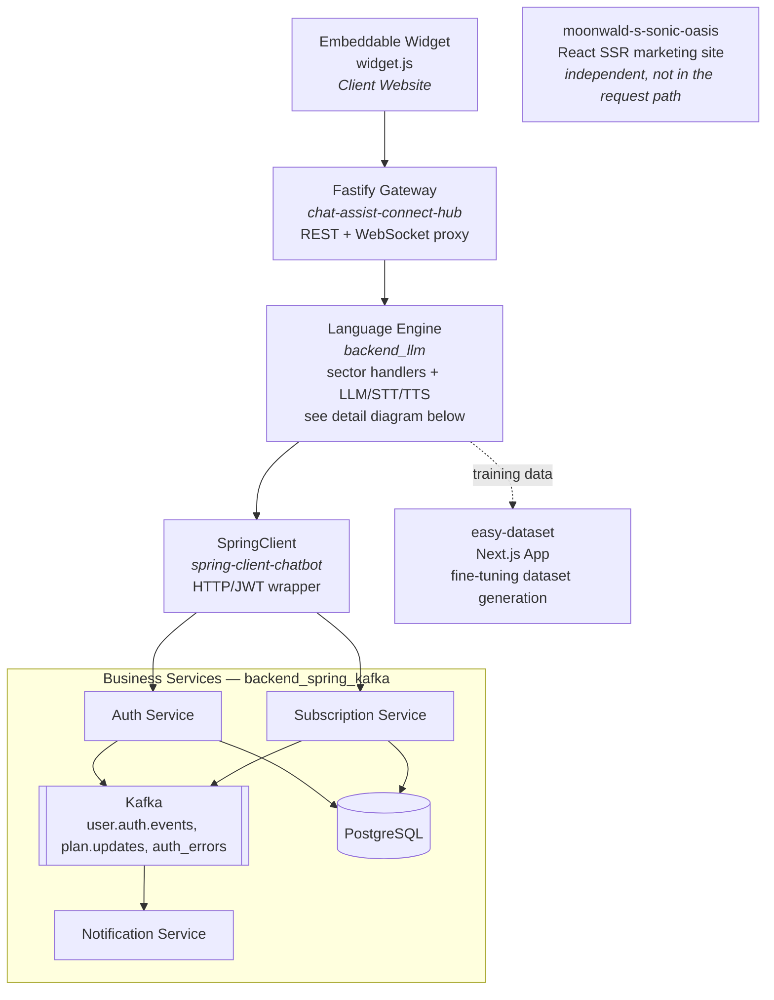
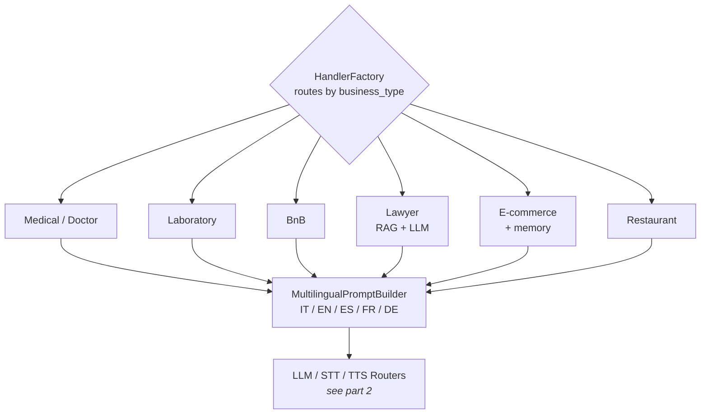
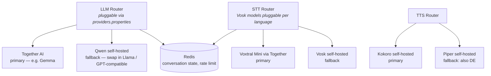

# Chatbot Infrastructure Architecture

## Author
Aldo Grandoni

## Overview

This document describes the complete architecture of the Conversational chatbot platform: a multi-tenant system that provides virtual assistants (voice + text) embeddable into third-party websites, backed by a language-processing engine (LLM/STT/TTS), authentication, subscription management, notifications, and dataset-generation tooling for model fine-tuning.

The platform is composed of seven independent repositories, each responsible for a specific layer of the stack, orchestrated on a **k3s** cluster via Helm.

## System Architecture

**High-level platform flow:**

```mermaid
graph TB
    W[Embeddable Widget<br/>widget.js<br/><i>Client Website</i>]
    W --> GW

    GW[Fastify Gateway<br/><i>chat-assist-connect-hub</i><br/>REST + WebSocket proxy]
    GW --> ENGINE

    ENGINE[Language Engine<br/><i>backend_llm</i><br/>sector handlers + LLM/STT/TTS<br/>see detail diagram below]
    ENGINE --> SPC

    SPC[SpringClient<br/><i>spring-client-chatbot</i><br/>HTTP/JWT wrapper]
    SPC --> AUTH
    SPC --> SUB

    subgraph BUSINESS [" Business Services — backend_spring_kafka "]
        direction TB
        AUTH[Auth Service]
        SUB[Subscription Service]
        NOTIF[Notification Service]
        KAFKA[[Kafka<br/>user.auth.events, plan.updates, auth_errors]]
        PG[(PostgreSQL)]

        AUTH --> KAFKA
        SUB --> KAFKA
        KAFKA --> NOTIF
        AUTH --> PG
        SUB --> PG
    end

    ENGINE -.->|training data| ED

    ED[easy-dataset<br/>Next.js App<br/>fine-tuning dataset generation]

    MKT[moonwald-s-sonic-oasis<br/>React SSR marketing site<br/><i>independent, not in the request path</i>]
```

**Language Engine detail (`backend_llm`) — Part 1: sector routing:**

```mermaid
graph TB
    HF{HandlerFactory<br/>routes by business_type}

    HF --> H1[Medical / Doctor]
    HF --> H2[Laboratory]
    HF --> H3[BnB]
    HF --> H4[Lawyer<br/>RAG + LLM]
    HF --> H5[E-commerce<br/>+ memory]
    HF --> H6[Restaurant]

    H1 --> MPB
    H2 --> MPB
    H3 --> MPB
    H4 --> MPB
    H5 --> MPB
    H6 --> MPB

    MPB[MultilingualPromptBuilder<br/>IT / EN / ES / FR / DE]
    MPB --> ROUTERS[LLM / STT / TTS Routers<br/><i>see part 2</i>]
```

**Language Engine detail (`backend_llm`) — Part 2: pluggable provider routing:**

```mermaid
graph TB
    LLMR[LLM Router<br/><i>pluggable via providers.properties</i>]
    LLMR --> LLMP1[Together AI<br/>primary — e.g. Gemma]
    LLMR --> LLMP2[Qwen self-hosted<br/>fallback — swap in Llama / GPT-compatible]
    LLMR --> REDIS

    STTR[STT Router<br/><i>Vosk models pluggable per language</i>]
    STTR --> STTP1[Voxtral Mini via Together<br/>primary]
    STTR --> STTP2[Vosk self-hosted<br/>fallback]
    STTR --> REDIS

    TTSR[TTS Router]
    TTSR --> TTSP1[Kokoro self-hosted<br/>primary]
    TTSR --> TTSP2[Piper self-hosted<br/>fallback: also DE]

    REDIS[(Redis<br/>conversation state, rate limit)]
```

## Component Descriptions

### 1. `chat-assist-connect-hub` — Public Gateway and Widget

Public entry layer of the platform. A **Node.js/Fastify** service that exposes:

- **Embeddable JavaScript widget** (`widget.js`, `chatbot-widget.js`): a lightweight script (~50KB) to drop into any client website. It contains no business logic — only UI rendering (chat bubble, voice button), environment detection (production/demo/staging/local), and communication with the gateway.
- **REST proxy**: routes `/api/chat`, `/api/tts`, `/api/tts/features`, `/api/v1/widget/verify` to `backend_llm`, injecting the service JWT.
- **WebSocket proxy** (`/ws/chat`): validates `widget_key` and `Origin` before completing the WebSocket upgrade, applies per-IP rate limiting, then forwards frames bidirectionally to the `backend_llm` WebSocket.
- **Security**: whitelist of valid `widget_key`s, whitelist of allowed CORS origins, in-memory per-IP rate limiting.

This component fully decouples the client website from the LLM engine: the widget never knows the internal backend URL.

### 2. `backend_llm` — Language Processing Engine

**Python/FastAPI** service that is the core of the conversational intelligence. It exposes routes for:

- **Chat/LLM**: completions based on **Together AI** (primary model, e.g. `google/gemma-4-31B-it`), with fallback to a self-hosted LLM (Qwen) when available.
- **STT (Speech-to-Text)**: language-aware fallback chain — **Voxtral Mini 3B** via Together.ai as primary, **Vosk** (self-hosted, offline, zero cost) as fallback.
- **TTS (Text-to-Speech)**: **Kokoro** (self-hosted, supports IT/EN/ES/FR) as primary, **Piper** (self-hosted, also supports DE) as fallback when Kokoro doesn't support the requested language.
- **RAG and Intent Recognition**: dedicated routers for document search and user intent recognition.
- **WebSocket chat**: real-time channel for streaming conversations.
- **WhatsApp integration**: optional sidecar consumer, enabled via feature flag.

Provider configuration (fallback chains, models, URLs, supported languages) is externalized in a `providers.properties` file, loaded at runtime by a `ProviderConfigManager` that allows switching primary/fallback providers without modifying the code.

A co-located **Redis** instance maintains conversation state and rate limiting.

#### Multi-Sector Business Handlers

`backend_llm/chatbot-services` is designed to serve chat clients across **multiple business sectors** through a single deployment. A `HandlerFactory` (`handlers/handler_factory.py`) routes each incoming request to a sector-specific handler based on a `business_type` parameter sent by the widget:

- **Medical / Doctor** (`medical_handler.py`) — appointment scheduling, doctor consultations.
- **Laboratory** (`laboratory_handler.py`) — lab analysis booking.
- **BnB / Vacation Rentals** (`bnb_handler.py`) — room availability, booking, amenities, pricing.
- **Lawyer / Legal** (`lawyer_handler.py`) — legal Q&A powered by RAG over uploaded documents (contracts, guides), with LLM fallback when no matching document is found.
- **E-commerce** (`ecommerce_handler.py`) — product inquiries, order status, with session memory (`EnhancedBaseHandler`) that persists customer preferences across conversations.
- **Restaurant / Food Delivery** (`restaurant_handler.py`) — menu browsing, ordering, reservations, delivery info.
- **RAG / Document Q&A** (`rag_handler.py`) — generic document-based question answering, reused by other sector handlers (e.g. the Lawyer handler).

Each handler builds its system prompt via `MultilingualPromptBuilder`, which auto-detects the user's language (or uses the one passed by the widget) and generates natural responses in **Italian, English, Spanish, French, and German** without needing sector-specific translation files — the LLM itself produces the localized response from a language-tagged system prompt.

New sectors can be added by implementing a new handler class and registering it in `HandlerFactory._HANDLERS`, without touching the gateway, the widget, or the routing infrastructure.

#### Pluggable LLM / STT / TTS Model Switching

The engine is built so that the underlying AI models can be swapped **without code changes**, via the `providers.properties` file read by `ProviderConfigManager` (`shared/config/provider_config.py`):

- **LLM**: currently routes to **Together AI** (e.g. `google/gemma-4-31B-it`) as primary, with a self-hosted **Qwen** model as a documented (in-progress) fallback slot. Because the provider chain is config-driven, adding another OpenAI-compatible model (e.g. **Llama**, **GPT-family models** via an OpenAI-compatible endpoint, or any other Together.ai-hosted model) only requires adding a new `ProviderConfig` entry — no changes to `LLMService` are needed.
- **STT**: **Voxtral Mini 3B** (via Together.ai) as primary, **Vosk** (self-hosted, offline) as fallback. Vosk loads per-language acoustic models from a mounted volume (`vosk-models-pvc`); **adding support for a new spoken language** is done by dropping the corresponding Vosk model into that volume and registering the language code — no application redeploy is required for the model itself.
- **TTS**: **Kokoro** (self-hosted, IT/EN/ES/FR) as primary, **Piper** (self-hosted, adds DE) as fallback. Additional languages/voices are added the same way — by registering new voice IDs in `VOICE_MAP` and, if needed, a new provider entry.

This provider-abstraction layer is what allows the same deployment to serve a medical clinic in Italian and a restaurant in English/German with different models and voices, purely through configuration.

### 3. `backend_spring_kafka` — Business Services (Auth, Subscriptions, Notifications)

A set of **Spring Boot** microservices that handle application logic not related to AI:

- **`auth-service`**: user authentication, JWT issuance, role and subscription plan management.
- **`subscription-service`**: management of plans (free/basic/premium/professional/enterprise) that determine which TTS/STT/LLM providers are available to the user.
- **`notification-service`**: consumer of Kafka events for sending notifications (e.g. plan changes, authentication errors).

Inter-service communication happens over **Apache Kafka**, with dedicated topics (`user.auth.events`, `plan.updates`, `auth_errors`). An abstraction layer (`MessageTransport`/`KafkaTransport`) attempts delivery via Kafka and automatically falls back to a direct REST call if the broker is unavailable, ensuring resilience.

Persistent data (users, plans, event history) is stored in **PostgreSQL**.

### 4. `spring-client-chatbot` — Python Client for Spring Services

Python library (`SpringClient`) used by `backend_llm` to communicate with `backend_spring_kafka` without duplicating HTTP authentication logic. It handles:

- Login and JWT token retrieval/validation.
- Fetching user subscription data (to determine which TTS/STT/LLM provider to route to).
- Booking, cancelling, and querying slots/appointments (booking functionality used by vertical use cases, e.g. medical practice, restaurant).

It serves as a lightweight bridge between the Python conversational engine and the Java services, avoiding direct coupling between the two technology stacks.

### 5. `easy-dataset` — Fine-Tuning Dataset Generation

Standalone **Next.js** application, used as an offline/internal tool for building training datasets for the LLM models used by the platform:

- Extracts text from documents (PDF, Markdown, DOCX, EPUB) and intelligently segments them.
- Automatically generates questions, answers, and Chain-of-Thought reasoning using configurable LLMs (OpenAI-compatible: OpenAI, Ollama, Zhipu, OpenRouter, etc.).
- Supports single-turn, multi-turn, and image-QA datasets.
- Exports in formats compatible with **LLaMA Factory** and allows direct upload to **Hugging Face Hub**.

This component is not exposed in production: it's a support tool for preparing training/evaluation data for self-hosted models (e.g. the future Qwen fallback LLM in `backend_llm`).

### 6. `k3s_engine_llm` — LLM Engine Helm Chart

Helm chart dedicated to deploying `backend_llm` on the k3s cluster. Includes:

- **Deployment** of the FastAPI service with an init-container that waits for Redis availability.
- **Redis StatefulSet** with persistence and an auto-generated password.
- **Secrets** for provider API keys (Together AI, Cartesia, WhatsApp Business API).
- **NetworkPolicy** to isolate namespace traffic.
- **Optional sidecar** for the WhatsApp consumer and `easy-dataset` integration.
- Configuration via `values.yaml` to enable/disable feature flags (WhatsApp, autoscaling, etc.).

### 7. `k3s_Conversational` — Frontend and Public Gateway Helm Chart

Helm chart that orchestrates the public-facing part of the platform (domain `Conversational.dev`):

- **Frontend Deployment**: static Nginx site serving the React build of the marketing portal.
- **Gateway Deployment**: the `chat-assist-connect-hub` service (Node/Fastify), exposed internally on port 8080.
- **Multiple Ingresses** (Traefik): one for the main site (`Conversational.dev`, `www.Conversational.dev`), one for the API gateway (`api.Conversational.dev`), one dedicated to the WebSocket (`ws.Conversational.dev/ws/chat`) with `Exact` path matching to avoid routing conflicts.
- **Traefik Middleware**: security headers (HSTS, CSP, X-Frame-Options), rate limiting, dynamic CORS whitelist for the WebSocket channel.
- **ConfigMap**: Nginx configuration and dynamic site content (hero video, multilingual translations, social links) injected from `values.yaml` without needing a Docker image rebuild for content-only updates.

### Related Project: `moonwald-s-sonic-oasis`

Public marketing site (React/Vite with Nitro SSR), served by the frontend Deployment of the `k3s_Conversational` chart. Supports dynamic content (YouTube video, translations in 5 languages) configurable via ConfigMap without an image rebuild for text/content-only changes.

## Typical Request Flow

1. The user interacts with the **widget** embedded on the client website (voice or text).
2. The widget opens a **WebSocket** connection to `ws.Conversational.dev`, routed by the Traefik Ingress to the **gateway** (`chat-assist-connect-hub`).
3. The gateway validates `widget_key` and `Origin`, applies rate limiting, then forwards the request to **`backend_llm`**.
4. If the input is voice, `backend_llm` runs **STT** (Voxtral → Vosk fallback), then passes the text to the **LLM** engine (Together AI → Qwen fallback).
5. If needed, `backend_llm` queries **`spring-client-chatbot`** to verify the user's subscription plan (via `backend_spring_kafka`/`auth-service`/`subscription-service`), determining which providers are available.
6. The text response is optionally converted to audio via **TTS** (Kokoro → Piper fallback) and sent back to the client over WebSocket.
7. Relevant events (login, plan change, errors) are published to **Kafka** and consumed by `notification-service` for sending notifications.

## Security

- **Authentication**: JWT issued by `auth-service`, verified both by the gateway (for internal services) and by `backend_llm`.
- **Widget validation**: `widget_key` and `Origin` whitelist verified before every WebSocket upgrade.
- **Rate limiting**: applied both at the gateway level (per IP) and at the Traefik Middleware level (global).
- **Secrets management**: API keys and credentials managed via Kubernetes Secrets, never hardcoded in Helm charts.
- **TLS**: TLS termination on all Ingresses via cert-manager (Let's Encrypt).
- **Provider resilience**: every external service (LLM, STT, TTS, Kafka) has a self-hosted fallback chain to ensure service continuity and limit costs.

## Deployment

Each project has its own independent build/deploy cycle:

1. **`k3s_engine_llm`**: `helm upgrade backend-llm ./k3s_engine_llm/charts/backend-llm` for the LLM/STT/TTS engine.
2. **`k3s_Conversational`**: `helm upgrade Conversational ./k3s_Conversational/charts/Conversational` for the frontend + public gateway.
3. **`backend_spring_kafka`**: Maven/Gradle build of the individual Spring Boot microservices and deploy via the charts in `backend_spring_kafka/charts/`.
4. **Content-only updates** (text, translations, video IDs) do not require a Docker rebuild: they are injected via ConfigMap and applied with a simple `helm upgrade`.
5. **Code updates** (React, Fastify, FastAPI, Spring) require rebuilding the Docker image, importing it into the k3s containerd registry, and a subsequent `helm upgrade`.

## Status

⚠️ This codebase has been developed and tested locally / on the k3s staging cluster but has **not yet been pushed to the corresponding GitHub repositories**. The remote repositories currently reflect an earlier state of the project. Synchronization is pending.
